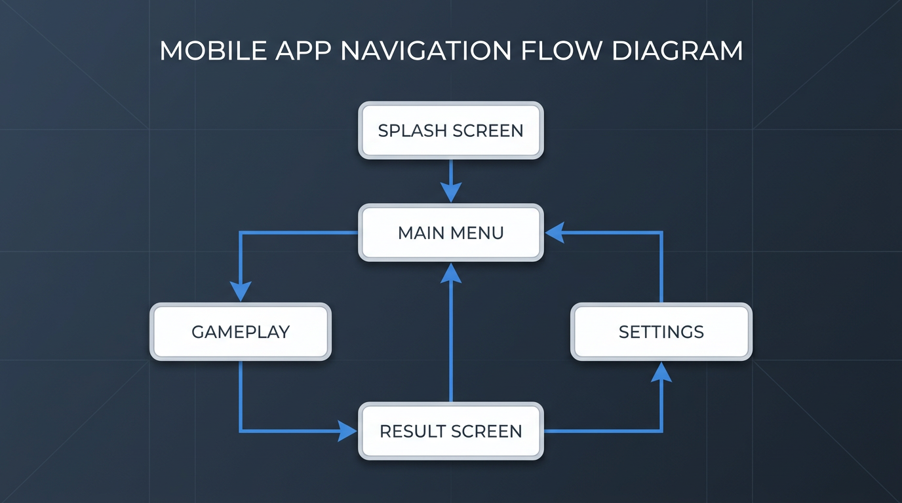
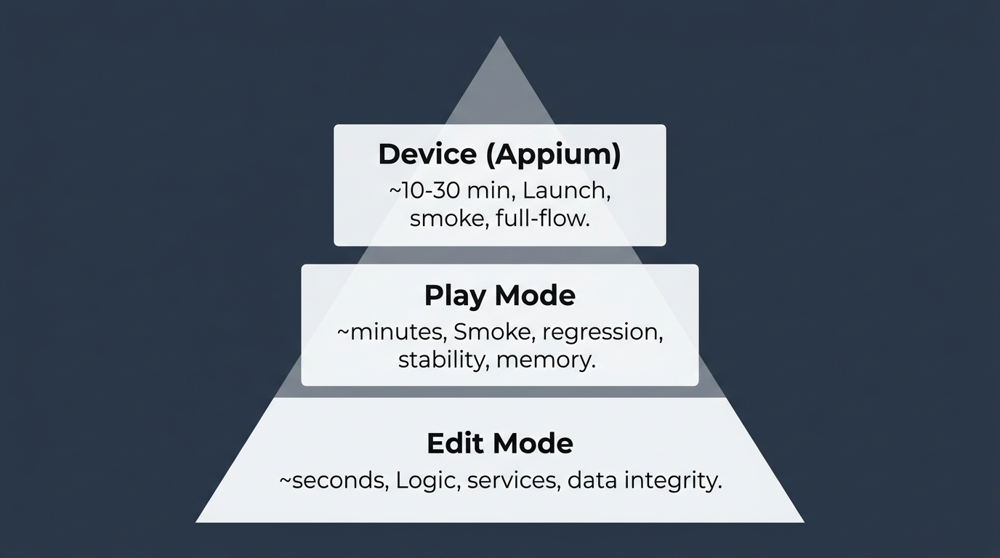

<div align="center">

# Unity Mobile QA Automation Showcase

**A production-ready QA automation portfolio for Unity Android/iOS projects**

*Every file helps you explain: **what you automated first**, **why that scope**, **how you would scale**, and **how this supports release confidence.***

</div>

---

## Quick Start

| I want to… | Go to |
|------------|-------|
| **Understand the strategy** | [Automation Strategy](docs/automation-strategy.md) |
| **Run tests** | [Setup Guide](docs/setup.md) |

---

## Sample App Flow



**Persistent:** Player progress, currency, settings • **Reward:** Virtual currency on level completion

---

## Test Pyramid



---

## What's Included

| Layer | Coverage |
|-------|----------|
| **Edit Mode** | Progress, currency, settings, GameManager, GameplaySession, SecureStorage; **parameterized** & **negative** tests |
| **Play Mode** | Smoke (UI-driven full flow), regression, stability, FPS, memory, load time, memory leaks, orientation |
| **Device** | Appium smoke + full-flow in CI; Android API 28+30; iOS simulator; Page Object Model |
| **Categories** | Smoke, Regression, DataIntegrity, Performance, BuildConfig — filter by `[Category]` |

### Intentionally Not Covered

- 100% code coverage
- Visual/UI pixel-perfect tests

---

## How to Run

### Unity Editor

1. Open project in Unity (2022.3 LTS recommended)
2. **Edit Mode:** Window → General → Test Runner → EditMode → Run All
3. **Play Mode:** Test Runner → PlayMode → Run All

### CI

- Push to `main` or `develop` (or open PR) → triggers [qa-automation.yml](.github/workflows/qa-automation.yml)
- Pipeline: validate → Edit Mode → Play Mode → quality gate → metrics → Android/iOS builds
- Add `UNITY_LICENSE` secret for real execution; quality gate fails on test failure

---

## Repository Structure

```
Unity-Mobile-QA/
├── Assets/
│   ├── Scripts/          Core, Gameplay, UI, Services
│   └── Tests/            EditMode, PlayMode, TestUtils
├── automation/mobile/    Appium specs, Page Object Model
├── docs/                 Strategy, case study, security, setup
├── .github/workflows/    QA pipeline, device farm, CodeQL
└── scripts/              Metrics, reporting, verification
```

---

## Portfolio Checklist

| Category | ✓ |
|----------|---|
| [Strategy](docs/automation-strategy.md) | Risk-based prioritization, case study |
| [Testability](Assets/Scripts/README.md) | Interfaces, DI, FakeDataFactory, test isolation |
| [Edit Mode](Assets/Tests/EditMode) | Services, GameManager, SecureStorage, parameterized |
| [Play Mode](Assets/Tests/PlayMode) | Smoke, regression, stability, memory leaks |
| [Device](automation/mobile/appium) | Appium, POM, explicit waits, JUnit metrics |
| [CI/CD](.github/workflows) | game-ci, quality gate, metrics dashboard |
| [Release](docs/rc-checklist.md) | Signing, checklist, rc-signing |
| [Observability](docs/observability.md) | Logs, telemetry, screenshots, dashboard |
| [Security](docs/security.md) | CodeQL, SBOM, SecureStorage, SSRF prevention |

---

## Recent Improvements

<details>
<summary><b>Expand: Test isolation, device metrics, security, and more</b></summary>

- **Test isolation** — `ServiceLocator.ResetForTests()` in Play Mode TearDown
- **Smoke vs Regression** — UI-driven vs API-driven; documented in [automation-strategy.md](docs/automation-strategy.md)
- **Demo mode badge** — CI job summary when `UNITY_LICENSE` not configured
- **Device metrics** — JUnit XML → `device-metrics.json`; merged into dashboard
- **Parameterized tests** — `CompleteSession_GrantsConfiguredReward`, `AddSessionScore_Negative_IgnoresValue`
- **Native accessibility** — `AccessibilityBridge`; per-element path in [accessibility.md](docs/accessibility.md)
- **Settings flow** — Play Mode + device tests for MainMenu → Settings → Back
- **Device robustness** — `waitForAppReady`, `waitForTransition` replace fixed pause
- **Page Object Model** — `AppPage.js` for Appium specs
- **Device matrix** — Android API 28 + 30
- **SecureStorage tests** — Encryption round-trip, corrupt-data handling
- **Failure reporting** — Slack webhook in CI, JIRA example with SSRF prevention
- **Security** — CodeQL C# + JS, SBOM, APK signature verification, IL2CPP enforced

</details>
